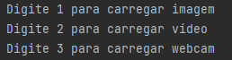
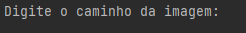
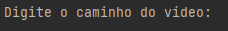
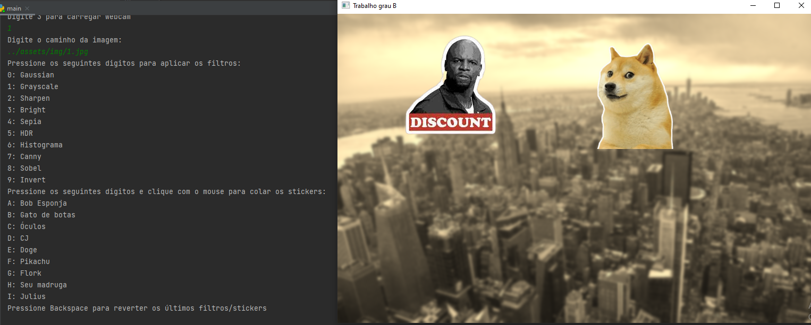
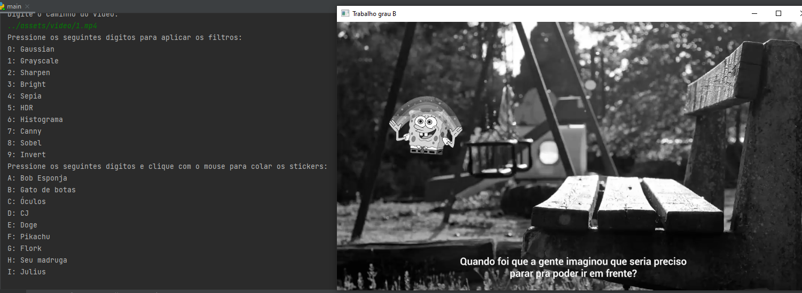

Necessário a instalação do Python e opencv-python para execução do projeto.

pip install opencv-python

Para execução, rodar a classe main e escolher uma das opções, se desejar carregar uma imagem, carregar vídeo ou utilizar a webcam

Para imagem ou vídeo, é necessário passar o caminho do arquivo

Após a seleção, irá carregar a janela do OpenCv e a lista de opções disponíveis para uso.

Dentro da imagem, temos as seguintes opções:
* 0 a 9 para aplicar um filtro
* 'a' até 'i' para selecionar um sticker, e clicar com o botão esquerdo do mouse sobre a imagem para colar. **Obs.: necessário usar letras minúsculas**
* Backspace para voltar ao estado anterior, removendo o último filtro ou sticker
* Ctrl + S para salvar a imagem atual

Dentro do vídeo/webcam, temos as seguintes opções:
* 0 a 9 para aplicar um filtro, digitar novamente para remover o mesmo filtro
* 'a' até 'i' para selecionar um sticker, e clicar com botão esquerdo do mouse sobre a imagem para colar. Selecionar e clicar usando um sticker que já está no vídeo, irá sobrescrevê-lo. **Obs.: necessário usar letras minúsculas**
* Ctrl + S para salvar o frame atual

